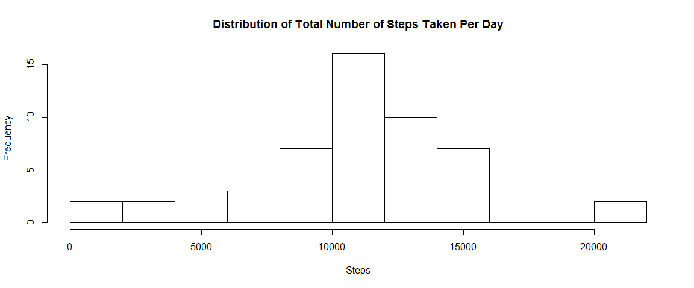
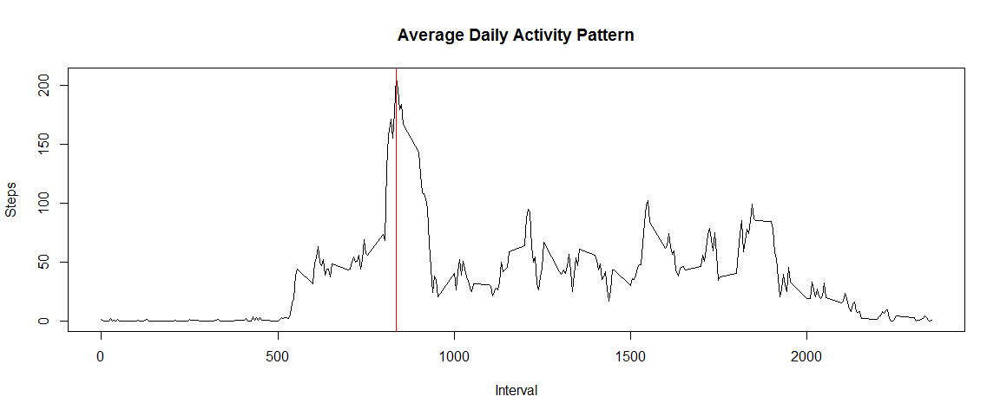
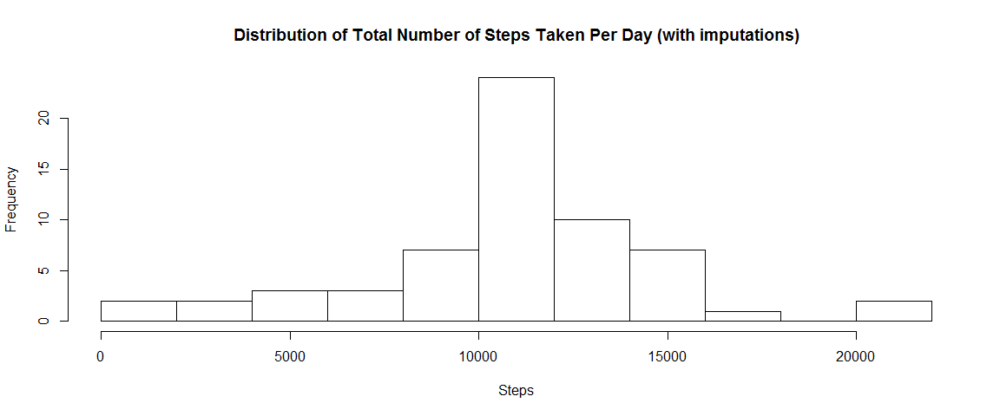
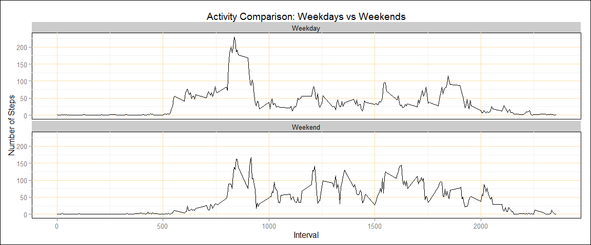

# Reproducible Research: Peer Assessment 1
SD Mitchell  
Aug 16, 2015  


## Loading and preprocessing the data
  

```r
targetFilename <- file.path(".", "activity.csv")
data <- read.csv(targetFilename, header=TRUE, sep=",", stringsAsFactors=FALSE, na.strings="NA", colClasses=c("numeric", "Date", "numeric"))
```
    
* steps is the number of steps taken in that interval
* date is the date on which the measurement occured
* interval is the wall time in five minute increments in 24h time with no separator (e.g. 1350 is 1:30 PM)
  
## What is mean total number of steps taken per day?
  

```r
stepsPerDay <- aggregate(steps ~ date, data=data, FUN=sum)
hist(stepsPerDay$steps, breaks=12, xlab="Steps", main="Mean Total Number of Steps Taken Per Day")
```

 

```r
meanStepsPerDay <- mean(stepsPerDay$steps)
medianStepsPerDay <- median(stepsPerDay$steps)
```
  
* The mean number of steps per day is 10766.19 steps
* The median number of steps per day is 10765 steps
  
## What is the average daily activity pattern?
  

```r
meanStepsPerInterval <- aggregate(steps ~ interval, data=data, FUN=mean)
plot(x=meanStepsPerInterval$interval, y=meanStepsPerInterval$steps, type="l", xlab="Interval", ylab="Steps", main="Average Daily Activity Pattern")
rowWithHighestAverage <- meanStepsPerInterval[meanStepsPerInterval$steps==max(meanStepsPerInterval$steps), ]
intervalWithHighestAverage <- rowWithHighestAverage$interval
abline(v=intervalWithHighestAverage, col="red")
```

 
  
The interval with the largest mean number of steps is the interval at 835, as marked by the red vertical line in the plot.
  
## Imputing missing values
  

```r
numberOfRowsMissingData <- dim(data)[1] - dim(data[complete.cases(data), ])[1]
```
  
The input data contains 2304 incomplete samples. We have already computed the mean number of steps per interval, so we are going to impute the incomplete "steps" values using those means.
  

```r
rownames(meanStepsPerInterval) <- meanStepsPerInterval$interval
imputedData <- within(data, {steps <- ifelse(is.na(steps), meanStepsPerInterval[as.character(interval), "steps"], steps)})
imputedStepsPerDay <- aggregate(steps ~ date, data=imputedData, FUN=sum)
hist(imputedStepsPerDay$steps, breaks=12, xlab="Steps", main="Mean Total Number of Steps Taken Per Day (with imputations)")
```

 

```r
imputedMeanStepsPerDay <- mean(imputedStepsPerDay$steps)
imputedMedianStepsPerDay <- median(imputedStepsPerDay$steps)
```
  
* The mean number of steps per day after imputation of the NA values is 10766.19 steps. This is identical to the original result, which makes sense because we used the mean of the original data to fill in the missing results; adding in more of the exact same number can't possibly result in a different value.
* The median number of steps per day after imputation of the NA values is 10766.19 steps. It makes sense that this now matches the mean due to the fact that we have inserted several new, identical samples at the mean causing the median to shift to the new value. This tells us that there are more NAs in the original data than any other single value (which is not unlikely).
  
The impact of imputing the missing data using the method chosen seems to have had very little overall impact on the summaries of the data sets. If the sampling failures were due to a sensor malfunction, it seems that this is a good candidate algorithm to fill in the missing steps data.
  
## Are there differences in activity patterns between weekdays and weekends?
  

```r
# Note that I didn't use weekdays() here because it gives back locale-specific strings; checking against them would make this NOT reproducible in any other OS locale settings. It is a safer bet to assume most locales have seven-day weeks and the docs for POSIXlt state that $wd starts on a Sunday, zero-indexed.

imputedDataToPlot <- cbind(imputedData, as.factor(ifelse(as.POSIXlt(imputedData$date)$wd %in% c(0, 6), "Weekend", "Weekday")))
colnames(imputedDataToPlot)[4] <- "TypeOfDay"

g <- ggplot(imputedDataToPlot, aes(interval, steps))
g <- g + geom_line(aes(group=TypeOfDay)) +
	facet_wrap(~TypeOfDay, ncol=1) +
	labs(x = "Interval", y = "Number of Steps", title="Activity Comparison: Weekdays vs Weekends") +
	theme(panel.background = element_rect(fill = "#FFFFFF", colour = "#000000"), plot.background = element_rect(fill = "#FFFFFF", colour = "#000000"), panel.grid.major = element_line(colour="#FFDEAD"))
g
```

 
  
It would seem that the differences in activity pattern during the weekends and weekdays mostly centers around sleeping in during the weekends (and therefore less activity in the earlier morning hours). There is also slightly more activity during weeknights, which could correspond to working later or perhaps running errands later at night due to work commitments.
  
  
  
